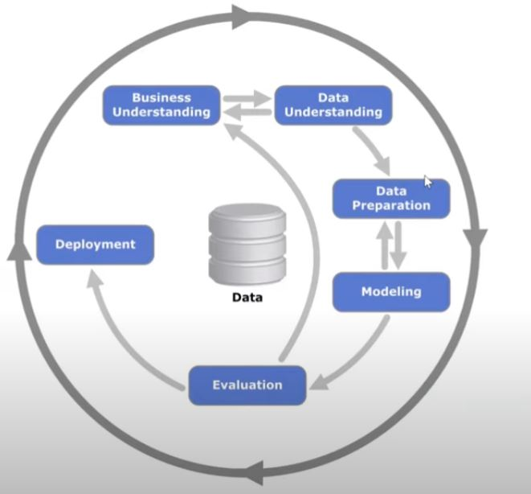

# Links
[Zoomcamp homepage](https://datatalks.club/courses/2021-winter-ml-zoomcamp.html)  
[GitHub repo](https://github.com/alexeygrigorev/mlbookcamp-code)  
[Slack channel](https://datatalks-club.slack.com)  
[Youtube ML Zoomcamp](https://www.youtube.com/channel/UCDvErgK0j5ur3aLgn6U-LqQ)  

# Preparing the environment in Windows
```
python -m pip install --upgrade pip
python -m venv d:\opt\python_environments\mlzoomcamp
d:\opt\python_environments\mlzoomcamp\Scripts\Activate.ps1
pip install numpy pandas scikit-learn seaborn jupyter tqdm flask requests gunicorn xgboost
ipython kernel install --name "mlzoomcamp" --user
git config --list --show-origin
git init .
git remote add origin https://github.com/TsarSPb/mlzoomcamp.git
git pull origin main
git branch -a
git checkout main
git add .
git commit -m "erster Commit. Richte mich ein."
git push origin main
```

# Preparing the environment in Linux (WSL)
```
sudo apt install python3-venv
python3 -m venv /mnt/d/python_environments/mlzoomcamp_linux
cd /mnt/d/python_environments/mlzoomcamp_linux/
source bin/activate
python -m pip install --upgrade pip
pip install numpy pandas scikit-learn seaborn jupyter tqdm flask requests gunicorn xgboost
ipython kernel install --name "mlzoomcamp" --user
```

# Part 1
## Lesson 1.4 CRISP-DM
  

It's about framing the big picture.
6 steps:
1. Business understanding  
Understand the scope of the problem and if ML is a good fit for this
1. Data understanding  
Is it available, what's there in the data, is there enough data
1. Data preparation  
Cleaning, converting, building pipelines
1. Modeling  
Building ML models, feature engineering
1. Evaluation  
Reevaluate with the business, check the metrics
1. Deploy  
Monitor and evaluate

Rinse and repeat.

## Lesson 1.7 Numpy refresher
```
python -m ipykernel install --user --name mlzoomcamp
jupyter kernelspec list
jupyter notebook --port 8888
```

# Part 2 ML For regression

# Part 5 Deployment
## Some basic stuff with Jupyter
Did some tests with the `LearnTest.ipynb`  
- created model
- saved / pickled it into `.pkl` file
- loaded and did predictions

## Basic stuff in console
Then converted into usable `.py` files - `train.py` and `predict.py`  
```
python train.py
> Trining model...
> Writing model...
python predict.py
> Input:  {'seniority': 14, 'home': 'parents', 'time': 24, 'age': 19, 'marital': 'single', 'records': 'no', 'job': 'fixed', 'expenses': 35, 'income': 28, 'assets': 0, 'debt': 0, 'amount': 400, 'price': 600}
> Churn prediction:  0.1475997638160077
```

## Flask 1
A very simple `Flask` app
```
python ping.py
 * Serving Flask app 'ping' (lazy loading)
 * Environment: production
   WARNING: This is a development server. Do not use it in a production deployment.
   Use a production WSGI server instead.
 * Debug mode: on
 * Restarting with stat
 * Debugger is active!
 * Debugger PIN: 103-155-887
 * Running on all addresses.
   WARNING: This is a development server. Do not use it in a production deployment.
 * Running on http://192.168.1.133:9696/ (Press CTRL+C to quit)
 ```
 You can now access the app by http get. http post won't work because we haven't enabled it.
 ```
 curl 127.0.0.1:9696/ping
 curl DESKTOP-80THIFC:9696/ping
 ip -4 address
 curl 172.19.64.100:9696/ping
 curl 192.168.1.133:9696/ping
> PONG
curl -X POST 192.168.1.133:9696/ping
> <!DOCTYPE HTML PUBLIC "-//W3C//DTD HTML 3.2 Final//EN">
> <title>405 Method Not Allowed</title>
> <h1>Method Not Allowed</h1>
> <p>The method is not allowed for the requested URL.</p>
```
Logs:
```
192.168.1.133 - - [09/Oct/2021 16:53:53] "GET / HTTP/1.1" 404 -
192.168.1.133 - - [09/Oct/2021 16:53:57] "GET /ping HTTP/1.1" 200 -
192.168.1.133 - - [09/Oct/2021 16:55:02] "POST /ping HTTP/1.1" 405 -
```

## Flask 2
Start `Flask` server with `python predict_flask.py`
Test the service
```
python predict_flask_test.py
> Churn is False, no need to do anything...
```
Using `curl`
With standalone data file
```
curl -d "@data.json" -H "Content-Type: application/json" -X POST 192.168.1.133:9696/predict
{
>   "churn": false,
>   "churn_probability": 0.1475997638160077
> }
```
Supplying data in command line
```
curl -d "{\"seniority\":14,\"home\":\"parents\",\"time\":24,\"age\":19,\"marital\":\"single\",\"records\":\"no\",\"job\":\"fixed\",\"expenses\":35,\"income\":28,\"assets\":0,\"debt\":0,\"amount\":400,\"price\":600}" -H "Content-Type: application/json" -X POST 192.168.1.133:9696/predict
> {
>   "churn": false,
>   "churn_probability": 0.1475997638160077
> }
```

## Gunicorn
`Gunicorn` is supposed to be production-ready, while `Flask` is not?
```
gunicorn --bind 0.0.0.0:9696 predict:app
gunicorn --bind 0.0.0.0:9696 predict_flask:app
```

## Pipenv
```
apt install python3-pip
pip install pipenv
```
One can get `The scripts pipenv and pipenv-resolver are installed in '/home/tsar/.local/bin' which is not on PATH.` message.  
This is likely due to the folder `~/.local/bin` was created by the installer and wasn't available before. Normally `~/.profile` already has the required block
```
# set PATH so it includes user's private bin if it exists
if [ -d "$HOME/.local/bin" ] ; then
    PATH="$HOME/.local/bin:$PATH"
fi
```
Just execute `source ~/.profile` then.  
If the block ins't there yes, add it and execute `source ~/.profile`.

Next, install the new environment.
```
pipenv install numpy scikit-learn flask
> ✔ Successfully created virtual environment!
> Virtualenv location: /home/tsar/.local/share/virtualenvs/part05-iUPvD6hU
```
Two files get added to the project: `Pipfile` and `Pipfile.lock`.
`Pipfile` contains information about the specified packages, it's like metadata for the environment.  
`Pipfile.locl` contains exact versions and hashes for the required modules and dependencies.  
After cloning the project / copying the files, one can just do `pipenv install`.  
Now enter the shell and run the app.
```
which python3
> /usr/bin/python3
pipenv shell
which python
> /home/tsar/.local/share/virtualenvs/part05-iUPvD6hU/bin/python
which gunicorn
> /home/tsar/.local/share/virtualenvs/part05-iUPvD6hU/bin/gunicorn
gunicorn --bind 0.0.0.0:9696 predict_flask:app
```
App should be up and running, one can test it manually or using `.py` we wrote earlier
```
curl http://127.0.0.1:9696/ping
> PONG
python3 predict_flask_test.py
> Churn is False, no need to do anything...
```

## Docker
```
> Just running a container
docker run -it --rm python:3.8.12-slim
```
A refresher on `ENTRYPOINT` vs `CMD`...  
> `CMD` can be totally overriden, while for `ENTRYPOINT` normally one can only override params of the command.  
> For `3.8.12-slim` we have CMD ["python3"]  
> Running `docker run -it --rm python:3.8.12-slim sh` will start the container with `bash` instead of `python`.  
> Instead of running `docker run redisimg redis -H something -u toto get key` one can have `ENTRYPOINT ["redis", "-H", "something", "-u", "toto"]`  
> And just run `docker run redisimg get key`  
> Using `docker run --entrypoint hostname demo` allows overriding `ENTRYPOINT` too  
> `CMD` and `ENTRYPOINT` can be used together too  
> ```
> ENTRYPOINT ["/bin/ping","-c","3"]  
> CMD ["localhost"]  
> ```

Building the app  
```
> Building image
docker build -t zoomcamp-test
> Checking layers
docker history zoomcamp-test
> Running a container
docker run -it --rm zoomcamp-test bash
docker run --rm -p 9696:9696 zoomcamp-test
```
